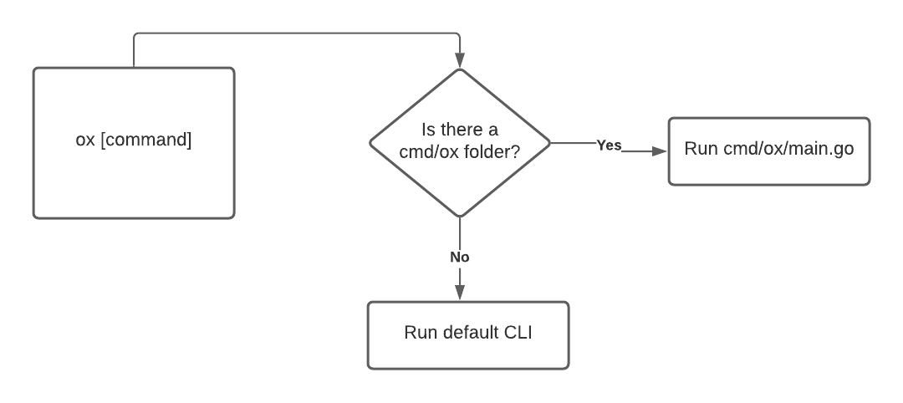

# Plugins 

**Important: This design is mostly authored by @markbates in the buffalo-cli.**

In order to provide customization capabilities for your app, Ox (Oxpecker) should allow developers to write their own plugins to be wired into the tooling, this way the Ox team does not have to cover every tool/workflow but instead, developers will have the opportunity to write their own tools and workflow.

# How does it work?

To make this work the CLI once started looks for `cmd/ox` folder, if it finds the folder will attempt to run `main.go` in there, otherwise it will run default plugins that the CLI ships with.



## Exploring cmd/ox/main

This is how `cmd/ox/main.go` looks. By exposing the `cli.New()` method and the Plugins attribute, oxpecker allows you to define the Plugins that will be available when the CLI starts.

```go
package main

import (
	"context"
	"fmt"
	"log"
	"os"
	"github.com/wawandco/oxpecker/cli"
)

func main() {
    fmt.Print("~~~~ Using app/cmd/ox ~~~\n\n")
	ctx := context.Background()
    
    pwd, err := os.Getwd()
	if err != nil {
		log.Fatal(err)
    }
    
	ox, err := cli.New()
	if err != nil {
		log.Fatal(err)
    }
    
	// append your plugins here
	// ox.Plugins = append(buffalo.Plugins, ...)
    
    err = ox.Run(ctx, pwd, os.Args[1:])
	if err != nil {
		log.Fatal(err)
	}
}

```

That the CLI allows the codebase to express which are the plugins it will use when the CLI starts. As seen in the following example.

```go
// cmd/ox/main.go
package main

import (
	"context"
	"fmt"
	"log"
	"os"
    "github.com/wawandco/oxpecker/cli"
    wgins "github.com/wawandco/plugins"
    "app/cmd/plugins" // custom app plugins
)

func main() {
    fmt.Print("~~~~ Using app/cmd/ox ~~~\n\n")
	ctx := context.Background()
    
    pwd, err := os.Getwd()
	if err != nil {
		log.Fatal(err)
    }
    
	ox, err := cli.New()
	if err != nil {
		log.Fatal(err)
    }
    
	// append your plugins here
	ox.Plugins = append(
        wgins.Plugins,  //Base plugins
        
        plugins.Linter,
        plugins.AfterBuilder
    )
    
    err = ox.Run(ctx, pwd, os.Args[1:])
	if err != nil {
		log.Fatal(err)
	}
}
```

## What is a plugin ?

A plugin is just a `struct` that fulfils the Plugin interface, which means having a `Name() string` method.

The mechanics of how a plugin works and what it does depend on other interfaces and choices that each plugin makes. 

## But how to?

Even tho plugins are intended to have independence, there are some key interfaces that plugins need to meet to be wired with the CLI.

#### [Command]()

A Command is a plugin that is intended to be wired at the top of the CLI.

#### [PluginReceiver]()

A PluginReceiver is plugin that will receive all the plugins before the CLI being executed, this becomes important for plugins that require other plugins to complete their tasks. Internally a plugin could have its own interfaces to identify those plugins that it would use for the task at hand.

#### [FlagParser]()

A FlagParser plugin is one that will receive the flags before executing. This is helpful for commands to receive indications from the CLI.